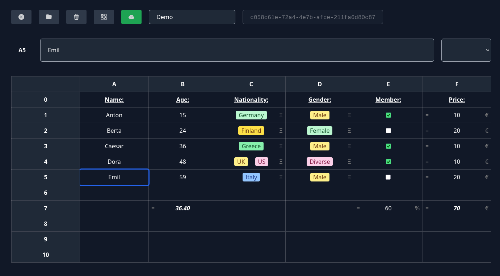

# Spreadsheets

This application provides a collaborative browser-based spreadsheets-client.

## Setup

-   required nodejs and npm to be installed
-   navigate to project directory
-   run `npm install` to install dependencies

## Starting

-   run `npm run start` to start frontend and backend together
-   to start only the frontend, run `npm run dev`
-   and for only the backend, run `node server.js`
